# CS3241-Computer-Graphics
OpenGL Programs made during the duration of the course

### Program 1: Basic OpenGL, input & interaction, and animation.

Program lets user click the left mouse button anywhere in the window to add a disc centered at the position of the mouse cursor. 

Once added, every disc continues to fly with a constant speed until it hits the window boundary. Then it is reflected (simple reflection with no energy loss)

 
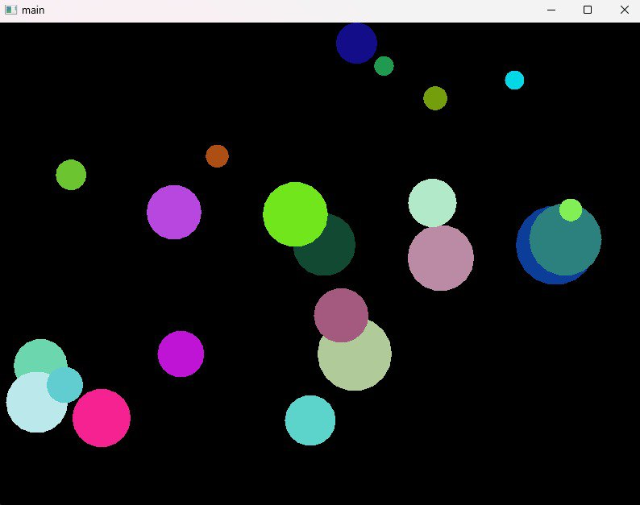
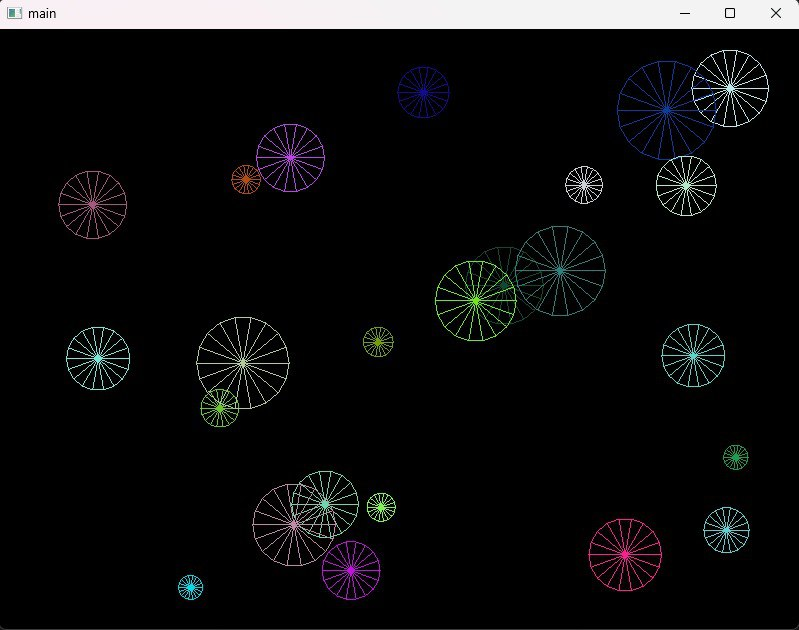

### Program 2: OpenGL viewing, transformations, hierarchical modeling, and animation.

When you run the program, user sees a spherical planet at the center of the window. There are a dozen cars moving on the planet surface, and each car moves in a different great circle
(you can search the web to find out what a great circle is), and they have different speeds and colors.

With respect to the planet, the camera’s position can be expressed as latitude and longitude, and its distance from the planet’s center. When the Left or Right arrow key is pressed, the camera’s longitude decreases or increases, respectively; and when the Down or Up arrow key is pressed, the camera’s latitude decreases or, respectively. The camera’s up-vector is always pointing north.

 
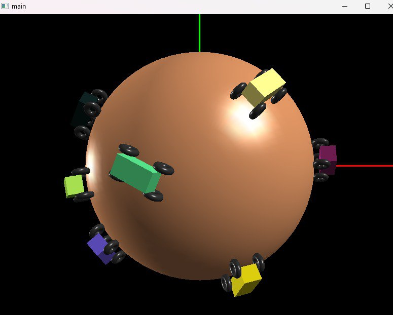
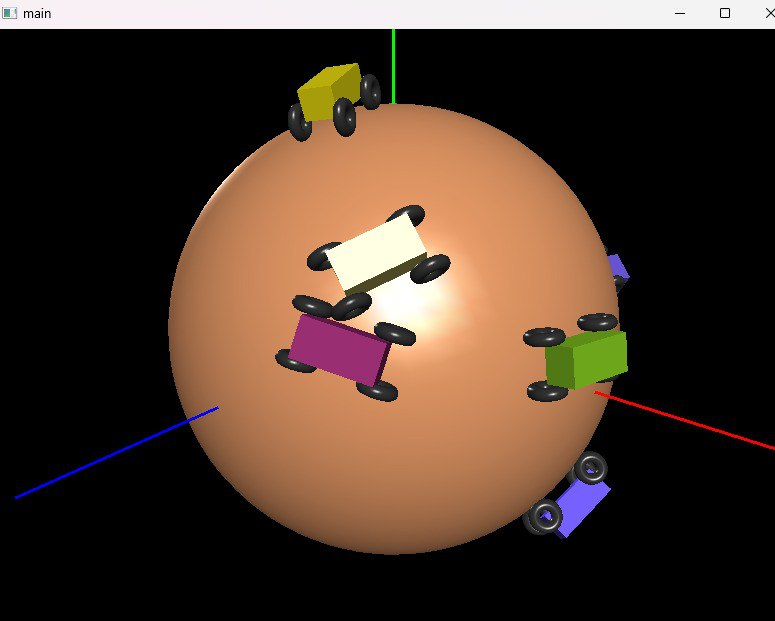

### Program 3: OpenGL program to simulate planar reflection using texture-mapping and a multipass rendering technique.

The 3D scene contains a table with a flat rectangular semi-reflective table-top. The scene is also populated with other objects, at least some resting on the table-top. The table-top reflects the scene.

In addition, new texture-mapped object are added into the scene. The new object(s) are positioned above the table-top, and may float in the air.
No 3D models in the GLUT library (e.g. glutSolidTorus()) are used for the new object(s), and function(s) are written by oneself to provide the polygons, vertex normal, texture 
coordinates, and material. Each new object has at least 4 polygons.

 
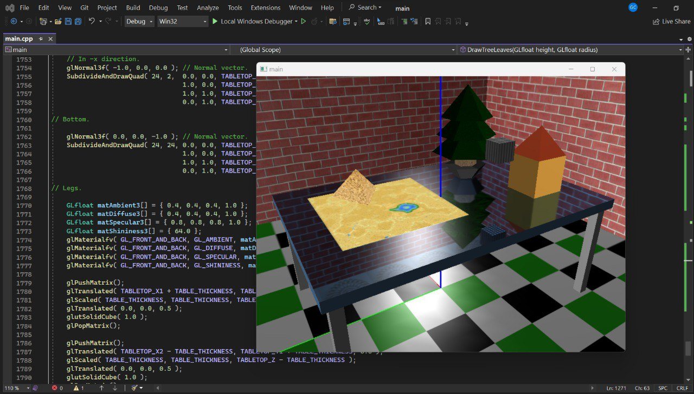
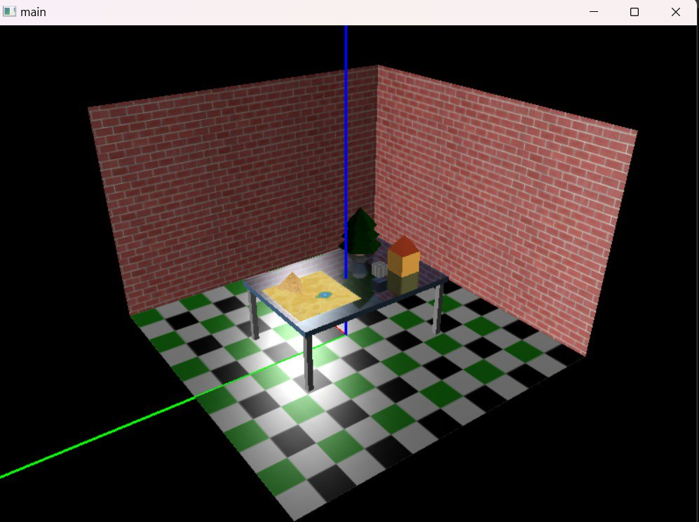
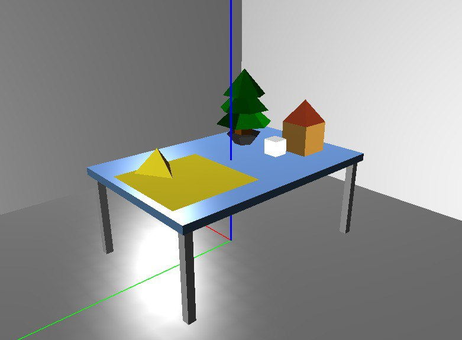
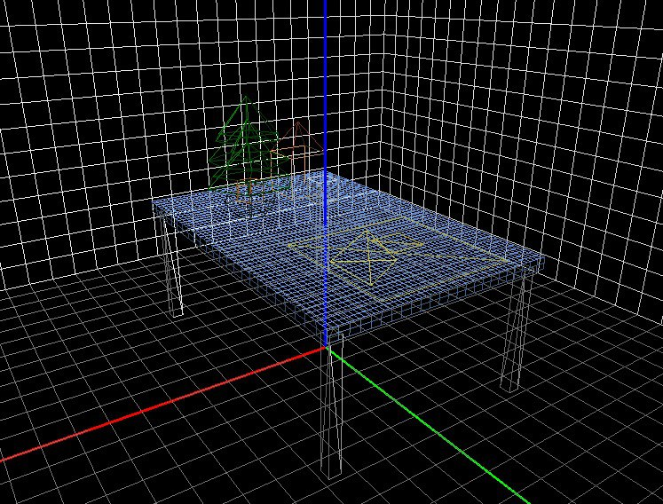

### Program 4: Ray Tracing via Whitted Ray Tracing Algorithm.

We compute ray intersection with some simple implicit-form surface primitive, do lighting computation, shoot shadow rays to generate shadows, spawn secondary rays, trace rays recursively by utilizing and adapting the Whitted Ray Tracing algorithm.

#### Whitted Ray Tracing Equation (Assuming all objects are opaque, ignoring refracted rays)

 𝐼 = 𝐼 𝑙𝑜𝑐𝑎𝑙 + 𝑘 𝑟𝑔 ∙ 𝐼 𝑟𝑒𝑓𝑙𝑒𝑐𝑡𝑒𝑑

 𝐼 𝑙𝑜𝑐𝑎𝑙 = 𝐼𝑎 ∙ 𝑘𝑎 + ∑( 𝑘𝑑(𝑁 ∙ 𝑳𝑖) + 𝑘𝑟(𝑅𝑖 ∙ 𝑽)ⁿ)

Where:
 - 𝐼: Final pixel color
 - 𝐼 𝑙𝑜𝑐𝑎𝑙: Local illumination, including ambient and shading 
    - 𝐼𝑎𝑘𝑎: Ambient light contribution.
    - ∑: Sum over all light sources (indexed by 𝑖) for shading.
    - 𝑘𝑑: Diffuse reflection coefficient.
    - 𝑁: Surface normal, 𝑳𝑖: Unit vector from intersect to light source.
    - 𝑘𝑟: Specular reflection coefficient.
    - 𝑅𝑖: The reflection vector, 𝑉: Unit vector from intersect to camera.
    - 𝑛: shininess (Phong) exponent.
- 𝑘𝑟𝑔: Reflection coefficient, 𝐼𝑟𝑒𝑓𝑙𝑒𝑐𝑡𝑒𝑑: Reflected color.

Here, a 3d scene of two light sources, 3 intersecting planes, a cube made of triangles and two spheres are produced using the ray-sphere intersection routine implemented. We assume all objects are opaque. Shadow rays allow shadows to be depicted in the scene. 

Additionally, a new scene was modelled to reflect a certain mood in face of upcoming assignments and project deadlines. 

 
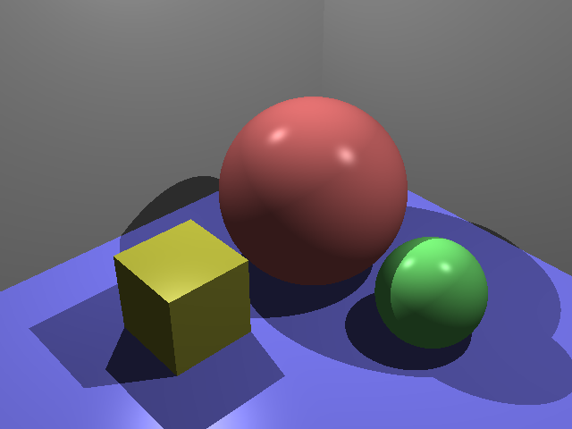
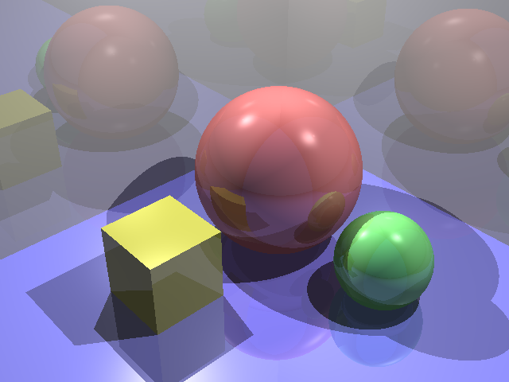
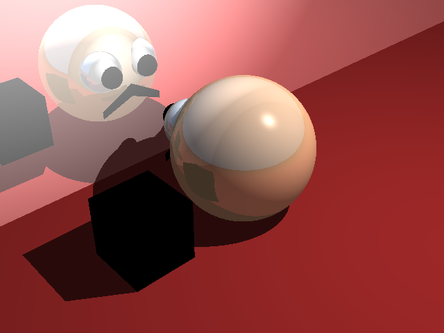

